# sensordemo

TUI ASCII demos of the phone's sensors, fed by [`sensord`](../sensord). Meant to be viewed from within [`Termux`](https://github.com/termux/termux-app).

Developed and tested on a Moto G17 Power.

```sh
sensordemo list               # the demos
sensordemo donut              # a demo by name
sensordemo gyroscope          # a sensor: picks a demo that uses it
sensordemo light,proximity    # several sensors: picks a demo that uses all of them
sensordemo --gray fluid       # start in grayscale
sensordemo hourglass 5m       # some demos take an argument
```

Keys shared by every demo: 
- `q` quit
- `c` cycle color palettes
- `?` info and help

## Demos

| | | |
|:-:|:-:|:-:|
| <code>candle</code><br><sub>game rotation vector, linear acceleration, proximity</sub><br>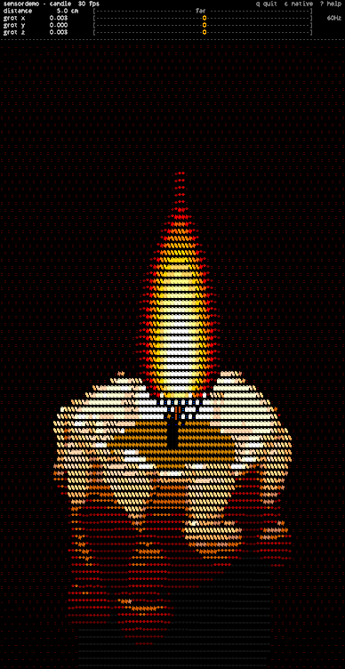 | <code>compass</code><br><sub>rotation vector, magnetometer, location</sub><br>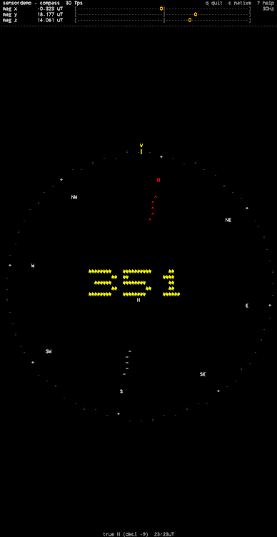 | <code>detector</code><br><sub>uncalibrated magnetometer, gravity</sub><br>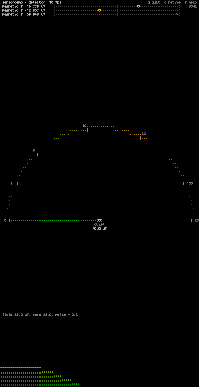 |
| <code>dice</code><br><sub>linear acceleration</sub><br>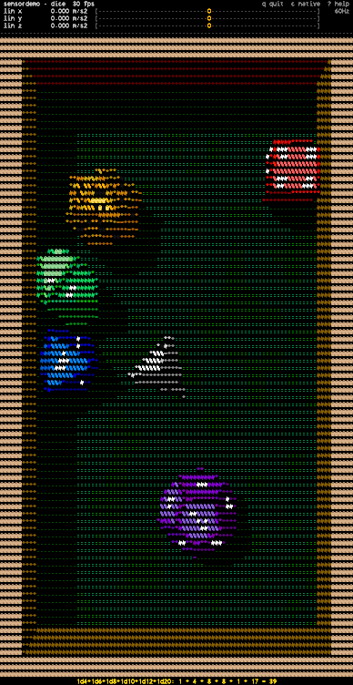 | <code>donut</code><br><sub>game rotation vector, gyroscope, light</sub><br>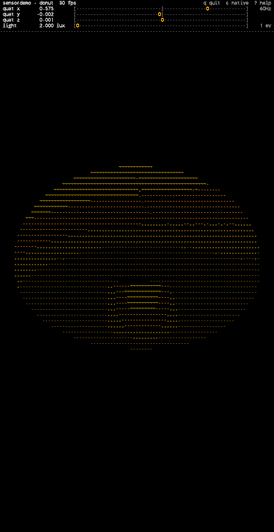 | <code>eye</code><br><sub>proximity, light, game rotation vector, accelerometer</sub><br>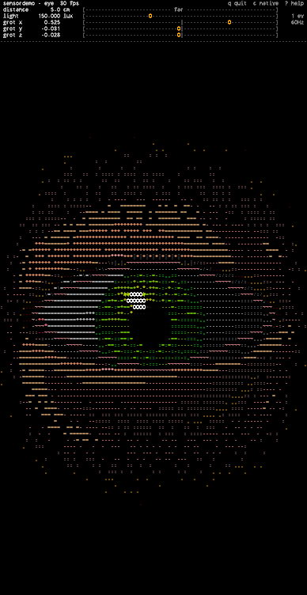 |
| <code>fluid</code><br><sub>accelerometer</sub><br>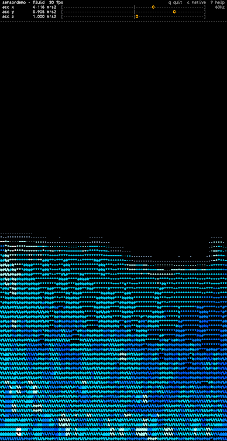 | <code>gestures</code><br><sub>Moto gestures, step detector</sub><br>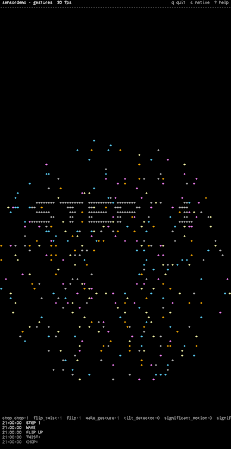 | <code>homing</code><br><sub>location, rotation vector</sub><br>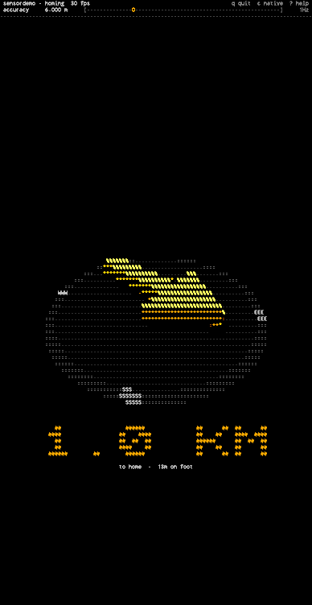 |
| <code>hourglass</code><br><sub>gravity</sub><br>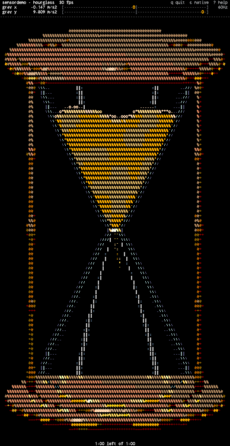 | <code>kaleidoscope</code><br><sub>gyroscope</sub><br>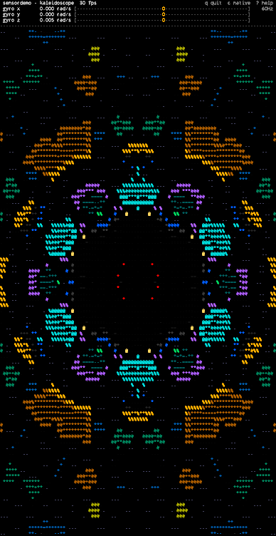 | <code>lavalamp</code><br><sub>game rotation vector, linear acceleration</sub><br>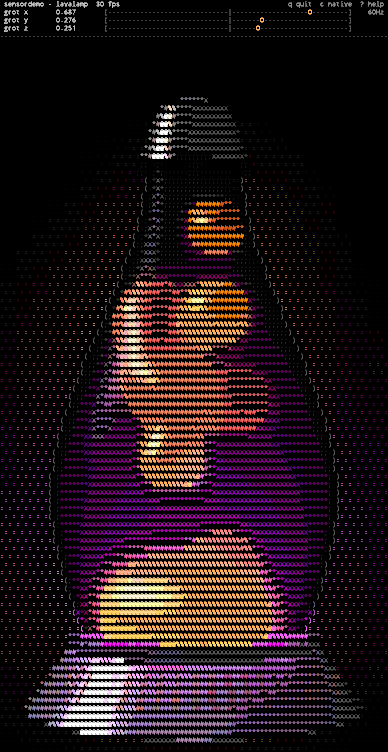 |
| <code>map</code><br><sub>location, rotation vector</sub><br>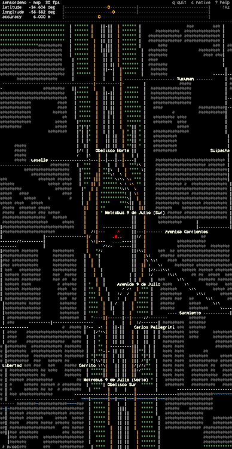 | <code>maze</code><br><sub>gravity</sub><br>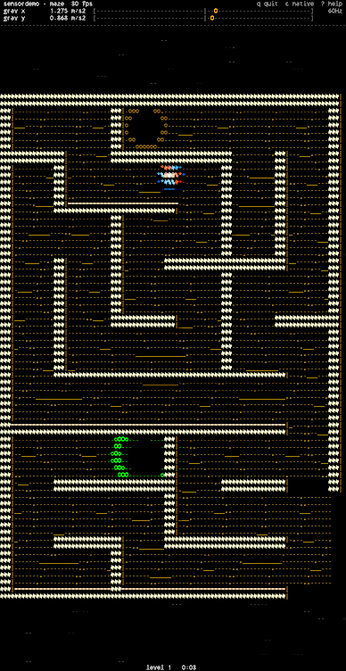 | <code>navball</code><br><sub>rotation vector, magnetometer, location</sub><br>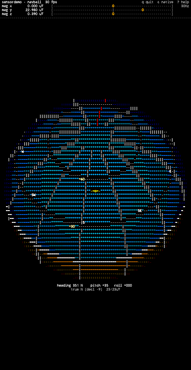 |
| <code>pendulum</code><br><sub>linear acceleration</sub><br>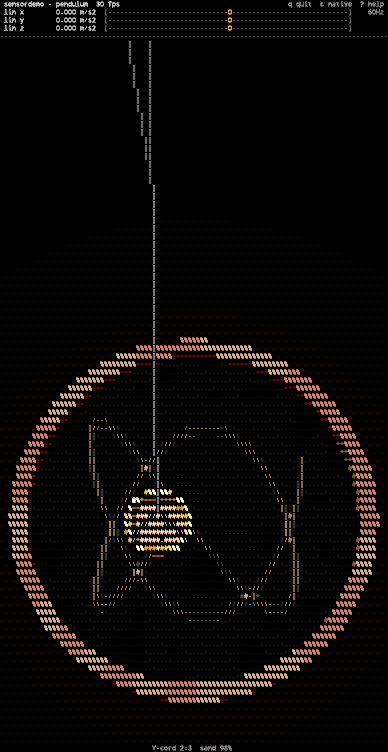 | <code>planetarium</code><br><sub>rotation vector, location</sub><br>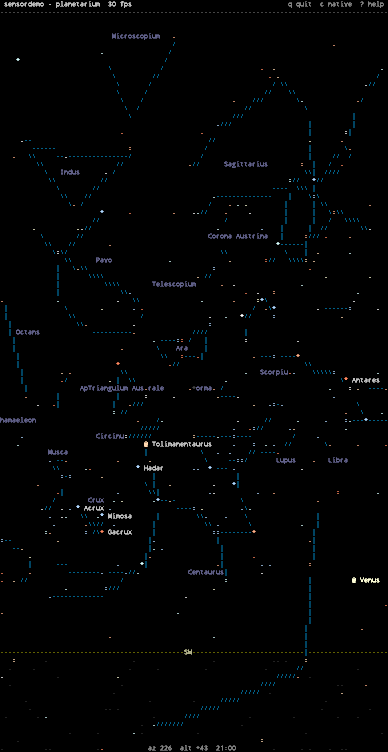 | <code>scope</code><br><sub>any</sub><br>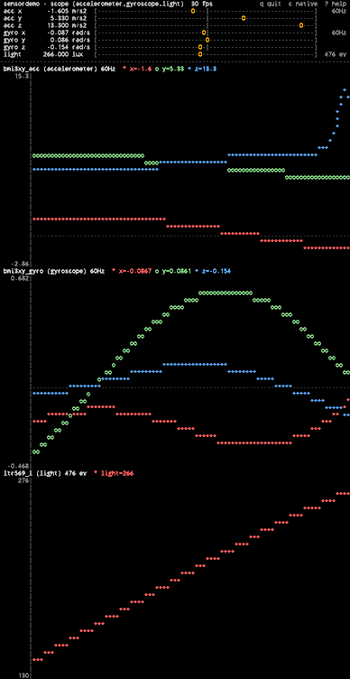 |
| <code>sky</code><br><sub>light</sub><br>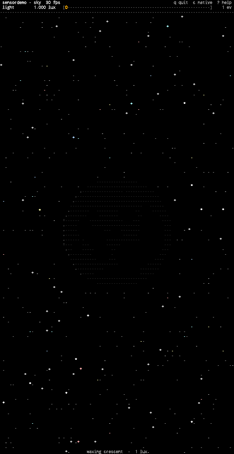 | <code>snowglobe</code><br><sub>linear acceleration, gravity, game rotation vector, gyroscope</sub><br>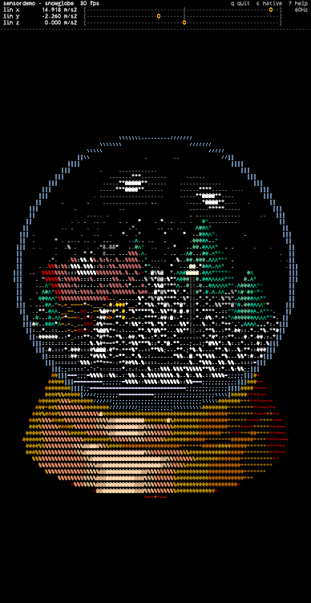 | <code>space</code><br><sub>game rotation vector, step detector</sub><br>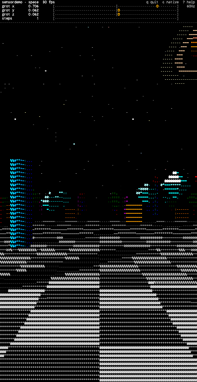 |
| <code>sundial</code><br><sub>rotation vector, location</sub><br>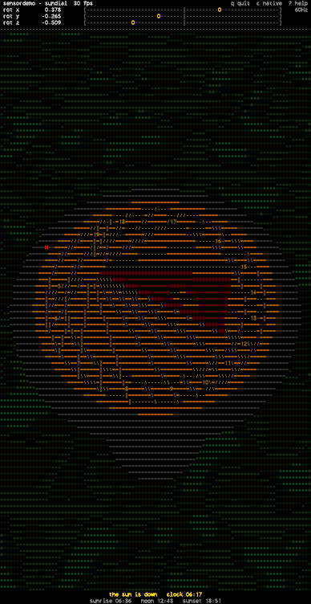 |  |  |

## Building

```sh
go build -o $PREFIX/bin/sensordemo .
```

The `sensord` client comes from `../sensord` via a `replace` in `go.mod`.

To check a demo without the phone, `--snapshot WxH` renders about a second off-screen and prints the last frame, and `--mock` feeds it fixed readings:

```sh
sensordemo --snapshot 70x30 --mock 'accelerometer=6,6,3' fluid
sensordemo --snapshot 70x30 --mock 'orient=45,0,0' compass       # yaw,pitch,roll
sensordemo --snapshot 70x30 --mock 'CHOP_CHOP=1' gestures
```

`--frames N` renders longer (30 frames is about a second).

To also see what the colors look like, the preview test renders a frame to a PNG, with each character as a patch of its terminal color and a rough glyph shape:

```sh
PREVIEW='hourglass:70x56:90:gravity=0,9.8,0:/tmp/hg.png' go test -run TestPreview ./tests/
```

## Data sources

### Map

The `map` demo downloads streets, buildings, water and parks data from the public [Overpass API](overpass-api.de). That request contains your approximate position. Results are cached in `~/.cache/sensordemo/osm/`, so revisiting an area doesn't ask again. Delete that directory to clear it. 

### Planetarium

The `planetarium`'s stars and constellations come from [d3-celestial](https://github.com/ofrohn/d3-celestial), whose star data comes from the HYG database. Planet positions use JPL's approximate Keplerian elements.
